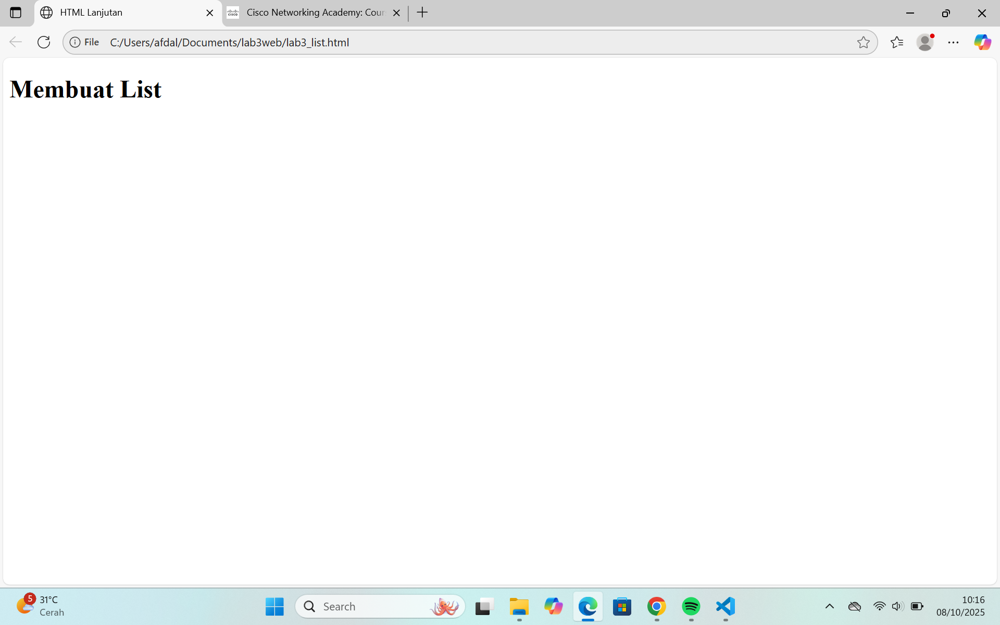
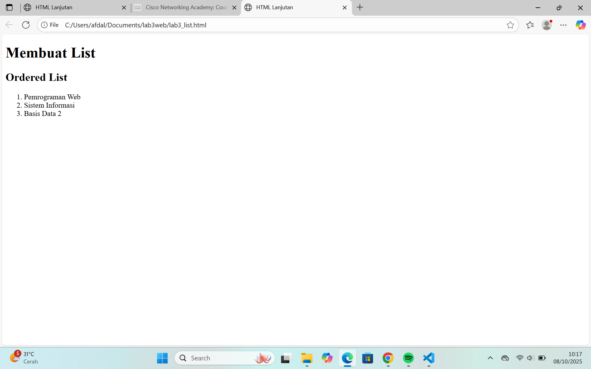
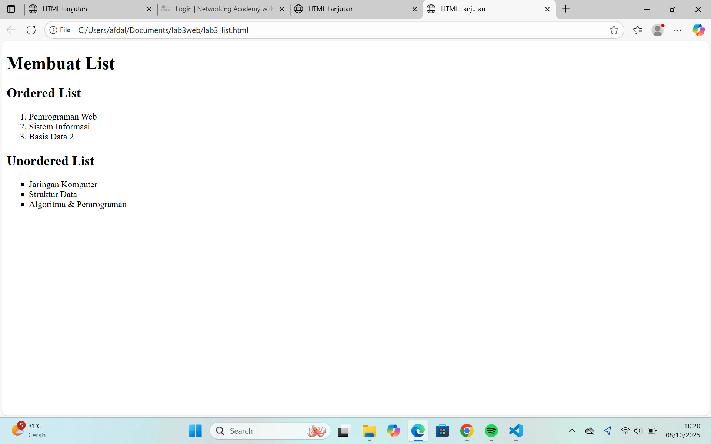
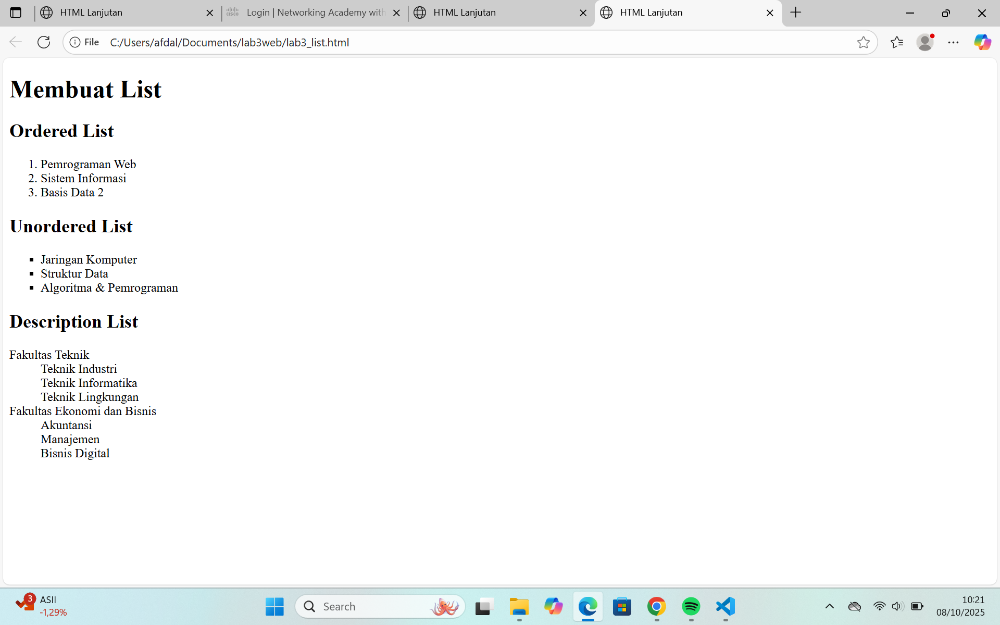
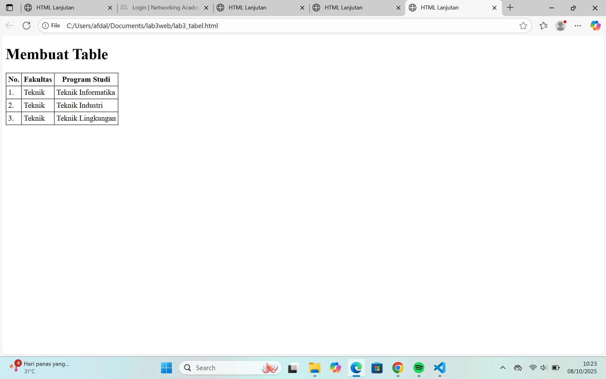
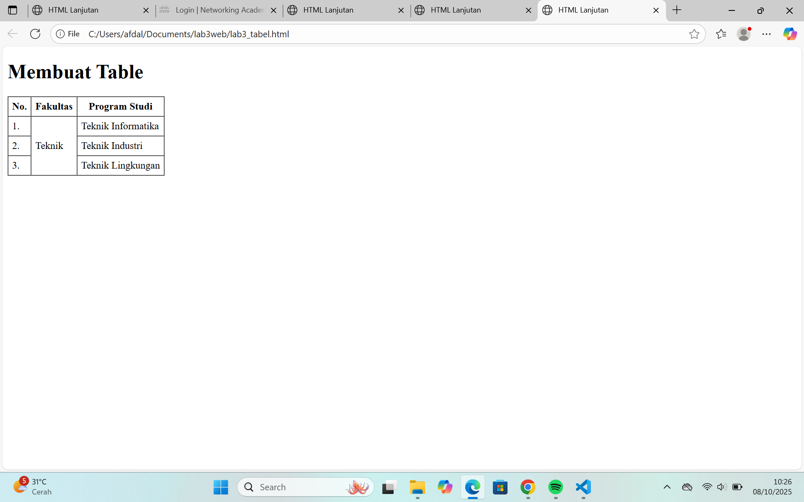
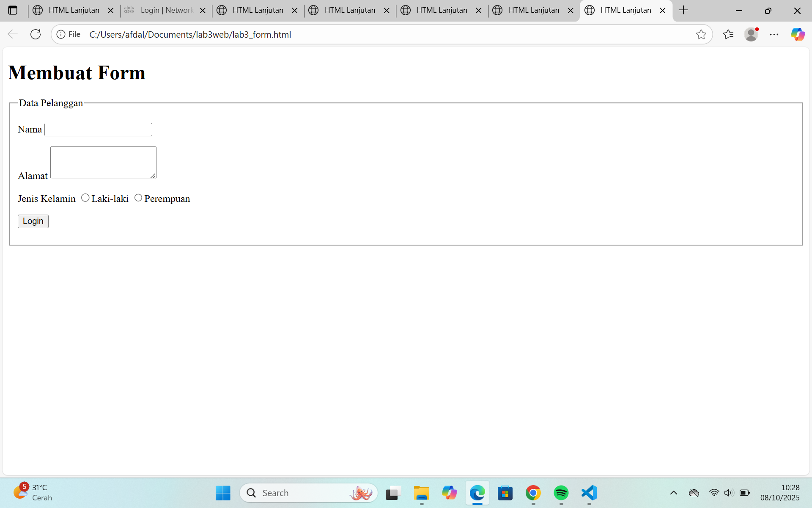
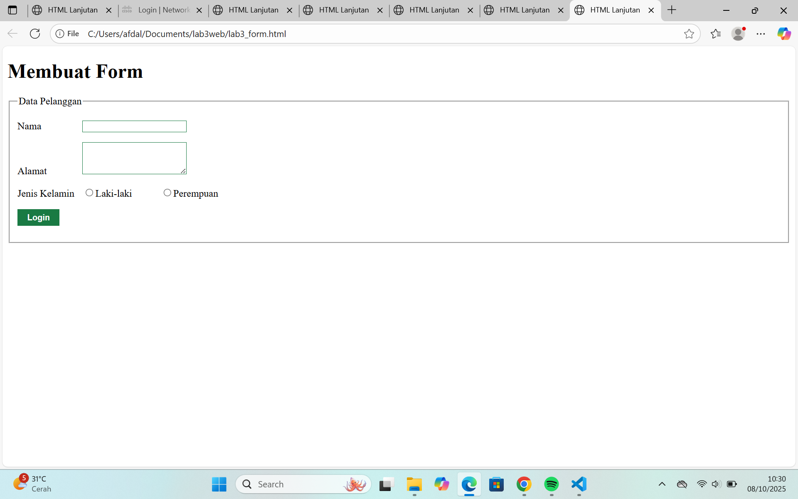

# 🧩 Praktikum 3: Membuat List, Table, dan Form

## 📘 Tujuan
Pada praktikum ini, mahasiswa belajar untuk:
1. Memahami struktur dasar pembuatan **List (Daftar)**.
2. Memahami struktur dasar pembuatan **Table (Tabel)**.
3. Memahami tag dasar untuk membuat **Form (Formulir)**.
4. Membuat dokumen HTML yang lebih kompleks.
5. Mengimplementasikan **CSS** pada List, Table, dan Form.

---

## ⚙️ Persiapan
1. Buka **VS Code** atau text editor lainnya.  
2. Buat folder baru dengan nama **Lab3Web**.  
3. Lakukan setiap langkah secara berurutan sesuai panduan modul.  
4. Validasi dokumen HTML menggunakan [validator.w3.org](https://validator.w3.org).

---

## 📝 Langkah-Langkah Praktikum

### 1. Membuat List
Buat file **lab3_list.html**, lalu isi struktur HTML dasar:
```html
<!DOCTYPE html>
<html lang="en">
<head>
  <meta charset="UTF-8">
  <meta name="viewport" content="width=device-width, initial-scale=1.0">
  <title>HTML Lanjutan</title>
</head>
<body>
  <header>
    <h1>Membuat List</h1>
  </header>
</body>
</html>
```
## Screenshot


### 2. Ordered List
Ordered List menampilkan daftar yang berurutan (1, 2, 3 atau A, B, C).
```html
<section id="order-list">
  <h2>Ordered List</h2>
  <ol type="A" start="D">
    <li>Pemrograman Web</li>
    <li>Sistem Informasi</li>
    <li>Basis Data 2</li>
  </ol>
</section>
```
## Screenshot


### 3. Unordered List
Unordered List menampilkan daftar tidak berurutan, dengan simbol seperti lingkaran atau kotak.
```html
<section id="unorder-list">
  <h2>Unordered List</h2>
  <ul type="square">
    <li>Jaringan Komputer</li>
    <li>Struktur Data</li>
    <li>Algoritma & Pemrograman</li>
  </ul>
</section>
```
## Screenshot


### 4. Description List
Description List digunakan untuk menampilkan istilah dan deskripsi.
```html
<section id="desc-list">
  <h2>Description List</h2>
  <dl>
    <dt>Fakultas Teknik</dt>
    <dd>Teknik Informatika</dd>
    <dd>Teknik Industri</dd>
    <dd>Teknik Lingkungan</dd>
    <dt>Fakultas Ekonomi dan Bisnis</dt>
    <dd>Akuntansi</dd>
    <dd>Manajemen</dd>
    <dd>Bisnis Digital</dd>
  </dl>
</section>
```
## Screenshot


### 5. Membuat Table
Buat file lab3_tabel.html dan isi struktur HTML-nya seperti berikut:
```html
<table border="1" cellpadding="4" cellspacing="0">
  <thead>
    <tr>
      <th>No.</th>
      <th>Fakultas</th>
      <th>Program Studi</th>
    </tr>
  </thead>
  <tbody>
    <tr>
      <td>1.</td>
      <td>Teknik</td>
      <td>Teknik Informatika</td>
    </tr>
    <tr>
      <td>2.</td>
      <td>Teknik</td>
      <td>Teknik Industri</td>
    </tr>
    <tr>
      <td>3.</td>
      <td>Teknik</td>
      <td>Teknik Lingkungan</td>
    </tr>
  </tbody>
</table>
```
## Screenshot


### 6. Menggabungkan Sel Data
Gunakan atribut rowspan atau colspan untuk menggabungkan baris atau kolom:
```html
<table border="1" cellpadding="6" cellspacing="0">
  <thead>
    <tr>
      <th>No.</th>
      <th>Fakultas</th>
      <th>Program Studi</th>
    </tr>
  </thead>
  <tbody>
    <tr>
      <td>1.</td>
      <td rowspan="3">Teknik</td>
      <td>Teknik Informatika</td>
    </tr>
    <tr>
      <td>2.</td>
      <td>Teknik Industri</td>
    </tr>
    <tr>
      <td>3.</td>
      <td>Teknik Lingkungan</td>
    </tr>
  </tbody>
</table>
```
## Screenshot


### 7. Membuat Form
Buat file lab3_form.html dengan struktur dasar HTML:
```html
<!DOCTYPE html>
<html lang="en">
<head>
  <meta charset="UTF-8">
  <meta name="viewport" content="width=device-width, initial-scale=1.0">
  <title>Membuat Form</title>
</head>
<body>
  <header>
    <h1>Form Data Pelanggan</h1>
  </header>
<form action="proses.php" method="post">
  <fieldset>
    <legend>Data Pelanggan</legend>
    <p>
      <label for="nama">Nama</label>
      <input type="text" id="nama" name="nama">
    </p>
    <p>
      <label for="alamat">Alamat</label>
      <textarea id="alamat" name="alamat" cols="20" rows="3"></textarea>
    </p>
    <p>
      <label>Jenis Kelamin</label>
      <input id="jk_l" type="radio" name="kelamin" value="L"><label for="jk_l">Laki-laki</label>
      <input id="jk_p" type="radio" name="kelamin" value="P"><label for="jk_p">Perempuan</label>
    </p>
    <p><input type="submit" value="Simpan"></p>
  </fieldset>
</form>
</body>
</html>
```
## Screenshot


### 8. Menambahkan Style dengan CSS
```html
<style>
  form p > label {
    display: inline-block;
    width: 100px;
  }
  form input[type="text"], form textarea {
    border: 1px solid #197a43;
  }
  form input[type="submit"] {
    border: 1px solid #197a43;
    background-color: #197a43;
    color: white;
    font-weight: bold;
    padding: 5px 15px;
  }
</style>
```
## Screenshot


### Membuat Form dengan Dropdown dan Listbox
```html
<form action="proses.php" method="post">
  <fieldset>
    <legend>Data Mahasiswa</legend>

    <p>
      <label for="jurusan">Pilih Jurusan:</label>
      <select id="jurusan" name="jurusan">
        <option value="TI">Teknik Informatika</option>
        <option value="SI">Sistem Informasi</option>
        <option value="RPL">Rekayasa Perangkat Lunak</option>
        <option value="MI">Manajemen Informatika</option>
      </select>
    </p>

    <p>
      <label for="matkul">Pilih Mata Kuliah:</label><br>
      <select id="matkul" name="matkul[]" size="4" multiple>
        <option value="web">Pemrograman Web</option>
        <option value="basisdata">Basis Data</option>
        <option value="algoritma">Algoritma & Pemrograman</option>
        <option value="jarkom">Jaringan Komputer</option>
      </select>
    </p>

    <p><input type="submit" value="Kirim"></p>
  </fieldset>
</form>
```
### Penjelasan:

select pertama adalah dropdown menu untuk memilih satu jurusan.

select kedua dengan atribut multiple menampilkan listbox yang memungkinkan memilih lebih dari satu mata kuliah.

size="4" menampilkan empat baris opsi agar terlihat jelas di halaman.


